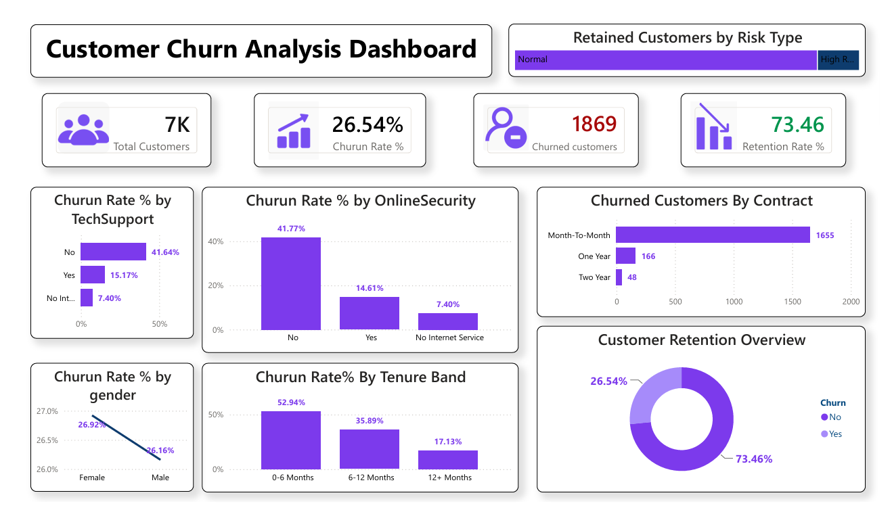

# Customer Churn Analysis Dashboard | Power BI

## Project Overview

Customer retention is a critical factor for business growth, especially in subscription-based industries such as telecommunications. Acquiring a new customer often costs significantly more than retaining an existing one. Therefore, understanding why customers leave and identifying factors that influence churn are essential for developing effective retention strategies.

This project focuses on analyzing customer churn behavior using Power BI. The dashboard provides an interactive view of customer retention metrics, churn trends, and key drivers that contribute to customer attrition. By leveraging data visualization and DAX calculations, the dashboard transforms raw customer data into actionable business insights.

---

## Business Problem

The telecom industry experiences intense competition, making customer retention a major business challenge. High churn rates directly affect revenue, profitability, and long-term growth.

The primary business questions addressed in this project are:

* What percentage of customers are leaving the company?
* Which customer groups are most likely to churn?
* How do contract types influence customer retention?
* Does the availability of online security and technical support affect churn?
* Are new customers more likely to leave than long-term customers?
* Which customer segments should be prioritized for retention campaigns?

---

## Dataset Description

The dataset contains customer information from a telecom company and includes demographic details, subscription information, service usage, and churn status.

### Key Attributes

#### Customer Information

* Customer ID
* Gender
* Senior Citizen Status
* Partner Status
* Dependents

#### Service Information

* Internet Service
* Online Security
* Online Backup
* Device Protection
* Tech Support
* Streaming TV
* Streaming Movies
* Phone Service
* Multiple Lines

#### Billing Information

* Contract Type
* Payment Method
* Monthly Charges
* Total Charges
* Paperless Billing

#### Customer Lifecycle Information

* Tenure
* Tenure Band
* Customer Type (New/Old)

#### Target Variable

* Churn (Yes/No)

---

## Project Workflow

### 1. Data Collection

The telecom customer dataset was imported into Power BI Desktop.

### 2. Data Cleaning

Several preprocessing steps were performed:

* Checked for missing values.
* Validated data types.
* Created tenure groups for customer segmentation.
* Created customer type categories.
* Generated risk classifications for retained customers.

### 3. Data Modeling

Relationships and calculated measures were created to support KPI calculations and visual analysis.

### 4. DAX Measure Creation

Custom DAX measures were developed to calculate key business metrics.

#### Total Customers

```DAX
Total Customers =
COUNT(telco_churn_unclean[customerID])
```

#### Churned Customers

```DAX
Churned Customers =
CALCULATE(
COUNT(telco_churn_unclean[customerID]),
telco_churn_unclean[Churn] = "Yes"
)
```

#### Retained Customers

```DAX
Retained Customers =
[Total Customers] - [Churned Customers]
```

#### Churn Rate %

```DAX
Churn Rate % =
DIVIDE(
[Churned Customers],
[Total Customers]
)
```

#### Retention Rate %

```DAX
Retention Rate % =
DIVIDE(
[Retained Customers],
[Total Customers]
)
```

---

# Dashboard Overview

The dashboard is designed using a clean white theme with purple accents to maintain a professional and modern appearance.
## Dashboard Preview



## KPI Cards

The top section provides a quick summary of customer retention performance:

### Total Customers

Displays the total customer base.

### Churn Rate %

Shows the percentage of customers who discontinued the service.

### Churned Customers

Displays the total number of customers lost.

### Retention Rate %

Shows the percentage of customers retained.

---

## Dashboard Visualizations

### 1. Retained Customers by Risk Type

This visual categorizes retained customers into risk groups.

Purpose:

* Identify customers who may leave in the future.
* Support proactive retention strategies.

---

### 2. Churn Rate by Tech Support

Analyzes churn behavior based on technical support availability.

Business Value:

* Customers without technical support exhibit significantly higher churn rates.
* Demonstrates the importance of support services in customer retention.

---

### 3. Churn Rate by Online Security

Compares churn rates among customers with and without online security services.

Business Value:

* Customers lacking online security are more likely to leave.
* Suggests opportunities for service bundling and upselling.

---

### 4. Churned Customers by Contract Type

Compares churn counts across contract categories:

* Month-to-Month
* One Year
* Two Year

Business Value:

* Month-to-Month customers represent the largest share of churn.
* Long-term contracts contribute to higher customer retention.

---

### 5. Churn Rate by Gender

Analyzes churn differences between male and female customers.

Business Value:

* Gender has minimal impact on churn behavior.
* Other business factors are stronger predictors of churn.

---

### 6. Churn Rate by Tenure Band

Segments customers according to their subscription duration.

Tenure Groups:

* 0–6 Months
* 6–12 Months
* 12+ Months

Business Value:

* New customers have the highest churn rates.
* Customer loyalty increases as tenure grows.

---

### 7. Customer Retention Overview

Provides a visual comparison of retained versus churned customers.

Business Value:

* Offers a high-level summary of overall retention performance.
* Useful for executive reporting.

---

# Key Insights

## Insight 1

Month-to-Month contract customers account for the majority of customer churn.

Recommendation:
Introduce incentives for customers to move toward annual contracts.

---

## Insight 2

Customers without Online Security show significantly higher churn rates.

Recommendation:
Bundle security services with subscription plans.

---

## Insight 3

Customers without Tech Support are more likely to leave.

Recommendation:
Promote premium support plans and improve support accessibility.

---

## Insight 4

Customers in their first six months exhibit the highest churn rates.

Recommendation:
Implement onboarding programs and early engagement campaigns.

---

## Insight 5

Gender shows little influence on churn behavior.

Recommendation:
Focus retention efforts on service-related factors rather than demographic segmentation.

---

# Skills Demonstrated

This project demonstrates the following Data Analyst skills:

### Data Analysis

* Customer Segmentation
* Retention Analysis
* Churn Analysis
* KPI Tracking

### Power BI

* Dashboard Design
* Interactive Visualizations
* DAX Calculations
* Data Modeling

### Business Intelligence

* Insight Generation
* Trend Analysis
* Decision Support
* Performance Monitoring

### Data Storytelling

* Translating business requirements into dashboards
* Presenting insights through effective visualizations
* Communicating recommendations using data

---

# Tools & Technologies

* Power BI Desktop
* DAX (Data Analysis Expressions)
* Data Visualization
* Data Cleaning
* Business Intelligence

---

# Conclusion

This Customer Churn Analysis Dashboard successfully identifies the primary drivers of customer attrition and provides actionable recommendations for improving retention. Through the use of Power BI, DAX measures, and business-focused visualizations, the project transforms customer data into meaningful insights that can support strategic decision-making.

The findings reveal that contract type, online security services, technical support availability, and customer tenure are the most influential factors affecting churn. By targeting these areas, telecom companies can improve customer satisfaction, reduce churn, and increase long-term profitability.
